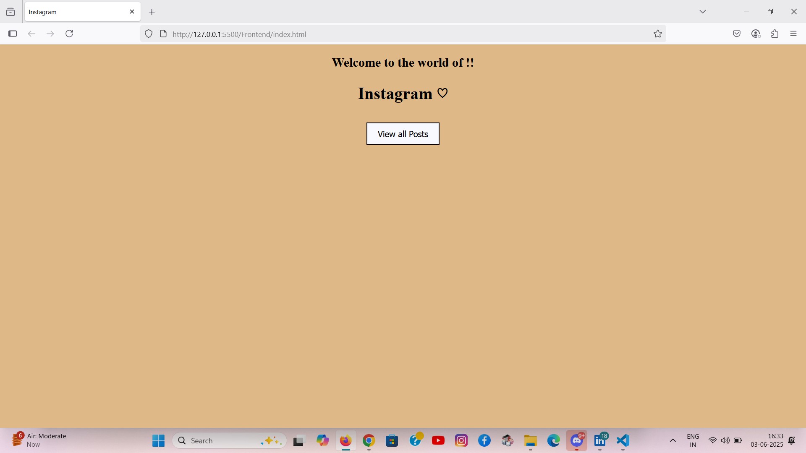
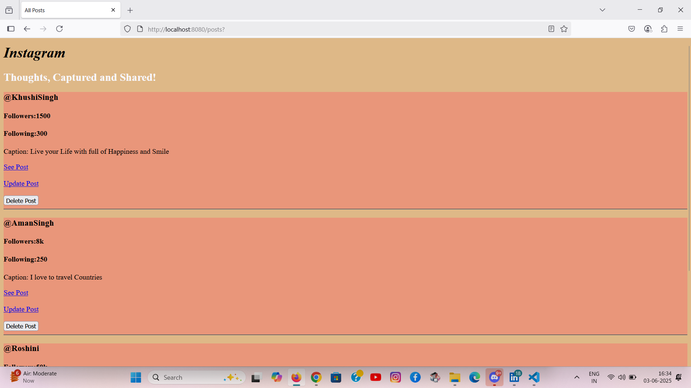
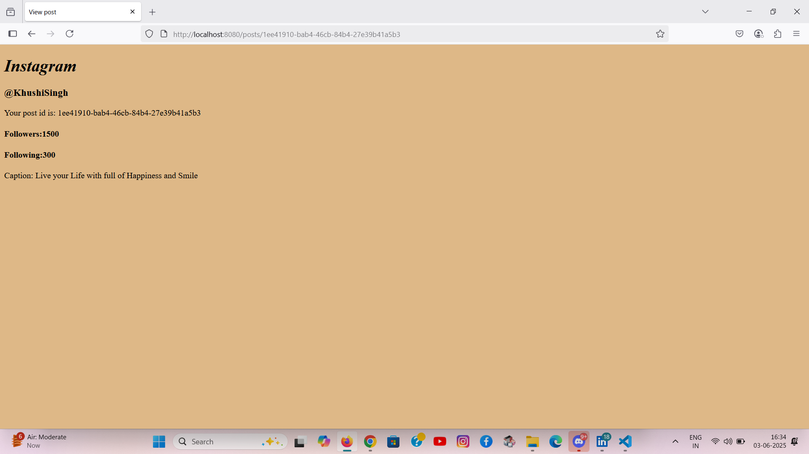
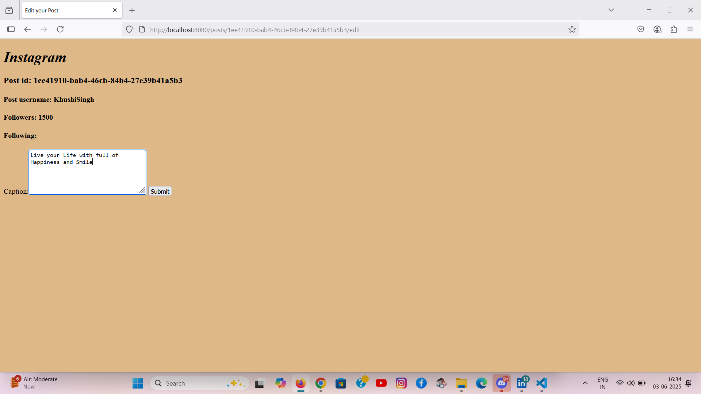

# Mini Insta Posts App

## Description
A simple full-stack web application inspired by Instagram’s core features. Built with Node.js, Express.js, and EJS on the backend, and a basic HTML/CSS frontend, this project demonstrates how RESTful APIs power Create, Read, Update, and Delete (CRUD) operations.

> ✨ Ideal for beginners to understand backend routing, EJS templating, and basic frontend-backend integration.

---

## Demo






## Tech Stack

- Frontend: HTML, CSS
- Backend: Node.js, Express.js, EJS
- Templating Engine: EJS (for dynamic rendering)
- Package Manager: npm


## Features

- 📌 Create new posts with a title and description
- 📝 Edit and update existing posts
- ❌ Delete posts
- 📋 View all posts on a dynamic page using EJS
- 🎨 Styled with basic CSS

---

## How to Run the Project

### Backend (Express Server)
```bash
cd Backend
npm install
node index.js

Visit: http://localhost:3000

Frontend
Just open Frontend/index.html in your browser (optional static page).

gitignore
To keep your repo clean, this project uses a .gitignore to exclude:

bash
Copy
Edit
Backend/node_modules/
.env
.log

## Installation
- Clone the repository: git clone [https://github.com/your-username/your-repository.git](https://github.com/your-username/your-repository.git)
- Open the project folder: cd your-repository
- Open the HTML file in your browser.


Author: Pranati Tiwari
GitHub: @pranati-tiwari14
LinkedIn: https://www.linkedin.com/in/pranati-tiwari-b67500264 

