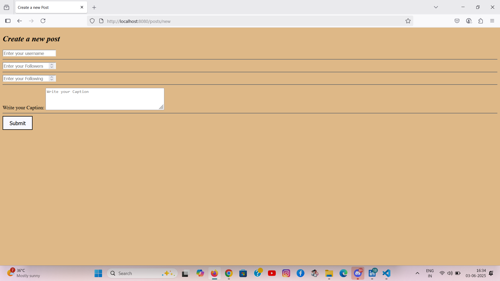

# Mini Insta Posts App

## Description
A simple full-stack web application inspired by Instagram’s core features. Built with Node.js, Express.js, and EJS on the backend, and a basic HTML/CSS frontend, this project demonstrates how RESTful APIs power Create, Read, Update, and Delete (CRUD) operations.

> ✨ Ideal for beginners to understand backend routing, EJS templating, and basic frontend-backend integration.

---

## Demo

## Tech Stack

- Frontend: HTML, CSS
- Backend: Node.js, Express.js, EJS
- Templating Engine: EJS (for dynamic rendering)
- Package Manager: npm

## Features

- 📌 Create new posts with a title and description
- 📝 Edit and update existing posts
- ❌ Delete posts
- 📋 View all posts on a dynamic page using EJS
- 🎨 Styled with basic CSS

---

## Installation
- Clone the repository: git clone [https://github.com/your-username/your-repository.git](https://github.com/your-username/your-repository.git)
- Open the project folder: cd your-repository
- Open the HTML file in your browser.

## Contributing
If you'd like to contribute to this project, please follow these steps:

- Fork the repository.
- Create a new branch: git checkout -b feature/new-feature.
- Make your changes and commit them: git commit -m 'Add new feature'.
- Push to the branch: git push origin feature/new-feature.
- Submit a pull request.

- Author: Pranati Tiwari
- GitHub: @pranati-tiwari14
- LinkedIn: https://www.linkedin.com/in/pranati-tiwari-b67500264 

